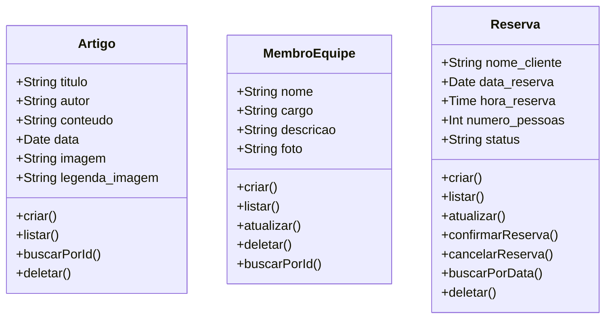

# Restaurante Apollo — Back-end

Repositório back-end do site do **Restaurante Apolo**, desenvolvido durante o 2º Desafio da **Missão EJECT 2026.1** — processo seletivo da Empresa Júnior da Escola de Ciências e Tecnologia da UFRN.

O projeto simula o desenvolvimento de um projeto real dentro da EJECT, utilizando a metodologia **Scrum** e integrando membros de diferentes células em um squad multidisciplinar.

---

## Tecnologias Utilizadas


---

## Como Rodar Localmente

### Pré-requisitos
- Python 3.10 ou superior instalado
- Git instalado

### Passo a passo

**1. Clone o repositório**
```bash
git clone https://github.com/jvguimaraess/eject-backend.git
cd eject-backend
```

**2. Crie e ative o ambiente virtual**
```bash
# Windows
python -m venv venv
venv\Scripts\activate

# Linux/Mac
source venv/bin/activate
```

**3. Instale as dependências**
```bash
pip install -r requirements.txt
```

**4. Aplique as migrations**
```bash
python manage.py migrate
```

**5. Crie um superusuário**
```bash
python manage.py createsuperuser
```

**6. Rode o servidor**
```bash
python manage.py runserver
```

**7. Acesse no navegador**
- Site: http://127.0.0.1:8000/
- Admin: http://127.0.0.1:8000/admin/

---

## Modelagem do Banco de Dados


---

## Squad 9 — Integrantes

| Nome | Célula | Função no Squad |
|---|---|---|
| João Vitor Guimarães | Projetos — Back-end | Back-end / Product Owner |
| José Fernandes Guedes | Projetos — Back-end | Back-end / Scrum Master |
| Breno José Teixeira | Projetos — Back-end | Back-end |
| Marcelo dos Santos Vieira | Projetos — Front-end | Front-end |
| Ryan Henrique Ferreira | Administrativo-Financeiro | Adm-Fin |

---

## Links

- **Deploy:** [restauranteapollodeploy.pythonanywhere.com](https://restauranteapollodeploy.pythonanywhere.com/)
- **Repositório Front-end:** [apollo-restaurant-system](https://github.com/marcelo0404/apollo-restaurant-system)
- **EJECT:** [ejectufrn.com.br](https://ejectufrn.com.br)

---

<p align="center">Desenvolvido pelo Squad 9 — Missão EJECT 2026.1 🚀</p>